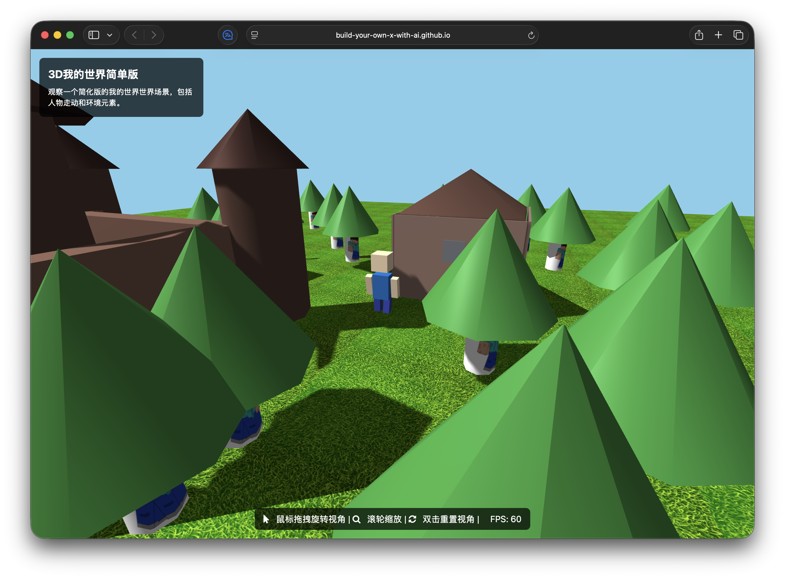

# 3D我的世界简单版
---

原始豆包地址：[复刻我的世界！-
Madge](https://www.doubao.com/code/launch/detail/37893120514)

一个基于Three.js构建的简化版我的世界3D场景，包含可交互的环境和动画人物。

Demo 地址：<https://build-your-own-x-with-ai.github.io/-Minecraft_doubao/>

## 截图

## 功能特性

- 🌍 3D世界场景，包含草地、树木、房屋和城堡
- 🚶 多个可动画人物，沿预设路径行走
- 🎮 交互式相机控制（旋转、缩放、平移）
- 🌞 动态光照和阴影效果
- 📊 实时FPS性能监控
- 🎨 使用Tailwind CSS美化界面

## 技术栈

- **Three.js** - 3D图形渲染
- **Tailwind CSS** - 样式框架
- **Font Awesome** - 图标库
- **原生JavaScript** - 核心逻辑

## 快速开始

1. 克隆或下载此项目
2. 在浏览器中打开 `index.html` 文件
3. 使用鼠标控制相机视角

## 控制说明

- **鼠标拖拽** - 旋转视角
- **鼠标滚轮** - 缩放视图
- **双击** - 重置视角

## 场景元素

- **地面** - 带草地纹理的大型平面
- **树木** - 多棵分布在场景中的树木
- **房屋** - 带窗户和门的简单房屋
- **城堡** - 带塔楼和城墙的城堡建筑
- **人物** - 两个沿不同路径行走的动画人物

## 性能优化

项目包含多项性能优化：
- 减少几何体分段数
- 优化阴影渲染
- 限制动画更新频率
- 视锥体剔除
- 材质实例复用

## 浏览器兼容性

支持所有现代浏览器（Chrome、Firefox、Safari、Edge）

## 许可证

请查看 LICENSE 文件了解详情。
